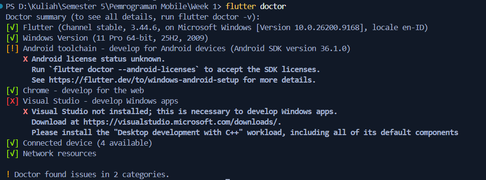
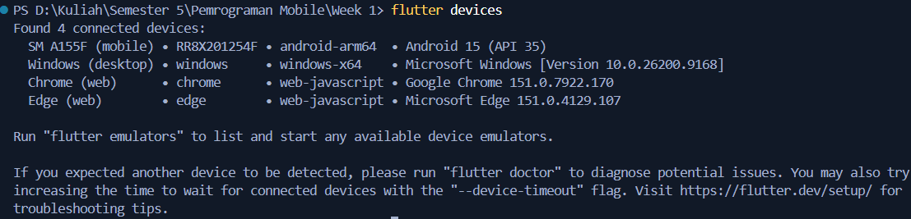
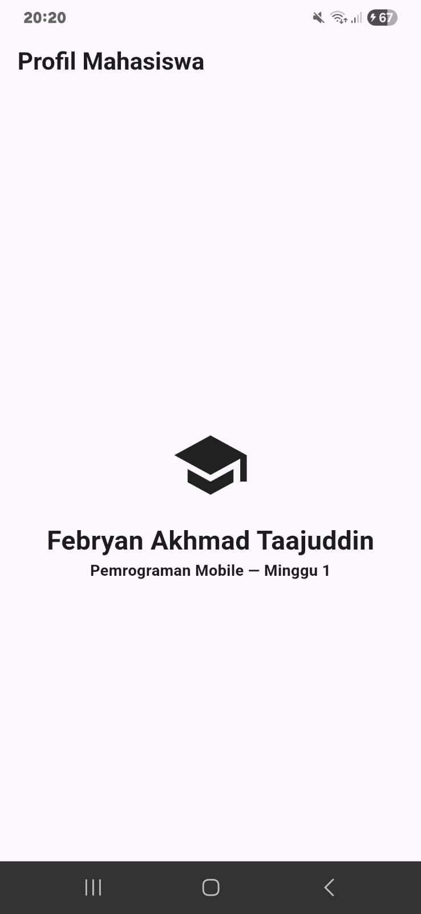
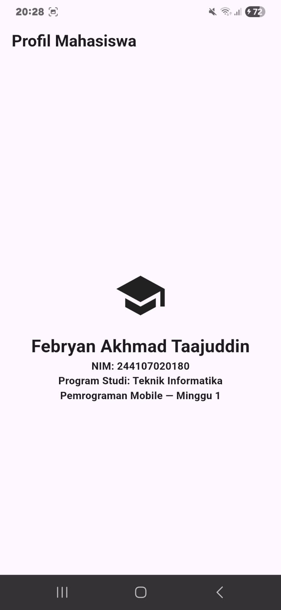

# my_first_app

## Checklist Verivikasi
1. Flutter doctor

2. Flutter devices

3. Aplikasi berjalan dan UI default telah diganti dengan profil sederhana.

4. Anda dapat menjelaskan perbedaan hot reload dan hot restart.
 Hot Reload hanya memperbarui kode tampilan (UI) dengan tetap mempertahankan data aplikasi, sedangkan Hot Restart mereset total aplikasi dan status datanya dari awal.

## Mini Assignment

 Kendala awal saya adalah setup devices ke HP. Flutter saya tidak mendeteksi HP jadi agak lama untuk setup awalnya.

## Refleksi
1. Kapan native lebih tepat dipilih daripada cross-platform?
 Lebih dipilih untuk komputasi berat real-time, Augmented Reality (AR) kompleks, atau game 3D intensif.

2. Bagaimana perubahan state berhubungan dengan widget tree dan UI deklaratif?
 Saat state berubah, Flutter otomatis memanggil ulang fungsi build() untuk merekonstruksi cabang widget tree yang terdampak dan hanya merender perubahan visual yang diperlukan ke layar.

3. Mengapa commit kecil dengan pesan jelas bermanfaat bagi pekerjaan tim dan portfolio?
 Karena untuk memudahkan dokumentasi bagian pekerjaan apa yang sudah dikerjakan