# Laporan Praktikum Week 02 — Declarative UI & Responsive Design
---

## 1.Eksperimen Awal & Praktikum Dasar

#### Student Dashboard Awal (Dark Mode)
Tahap awal mengimplementasikan DashboardApp dengan GridView.count dan pengujian tema gelap awal pada emulator ponsel.

| Screenshot | Keterangan |
| :---: | :--- |
| 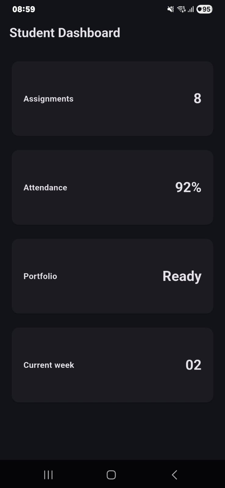 | **Dashboard Awal (Layar Sempit - Dark Mode)** Menampilkan 4 kartu statistik dasar (Assignments, Attendance, Portfolio, Current week) dalam 1 kolom. |

---

#### Eksperimen Tema Terang & Tema Gelap
Pengujian peralihan antara tema terang (*Light Mode*) dan tema gelap (*Dark Mode*) untuk memastikan kontras teks dan keterbacaan elemen antarmuka.

| Tema Terang (Light Mode) | Tema Gelap (Dark Mode) |
| :---: | :---: |
| 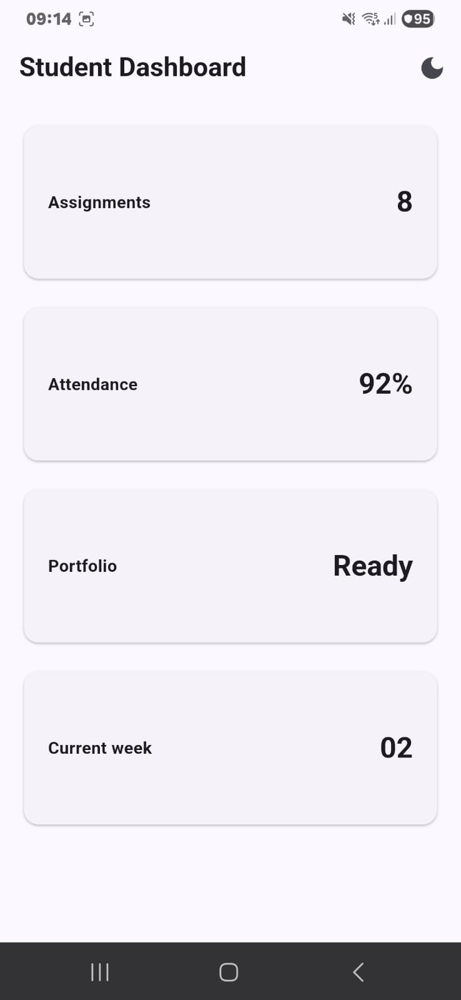 | 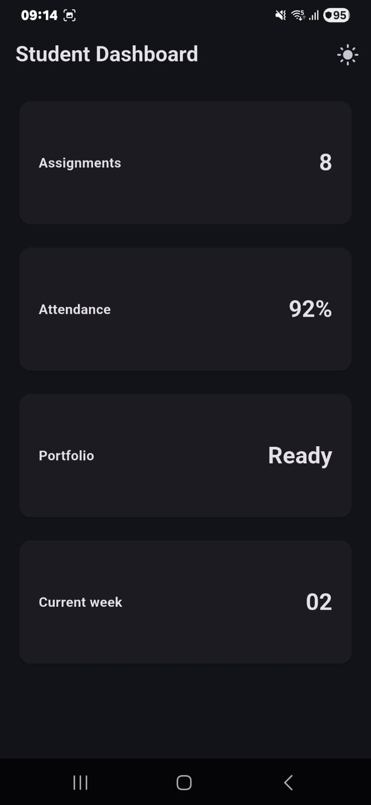 |
| *Tampilan latar terang dengan kontras warna Indigo seed.* | *Tampilan latar gelap dengan adaptasi kecerahan Material 3.* |

---

#### Penambahan Interaksi: StatefulWidget & CupertinoSwitch
Aplikasi diubah menjadi StatefulWidget dengan state lokal isDark. Widget CupertinoSwitch diintegrasikan pada AppBar.actions sebagai pengendali tema manual.

| Dark Mode Aktif (Switch ON) | Light Mode Aktif (Switch OFF) |
| :---: | :---: |
| 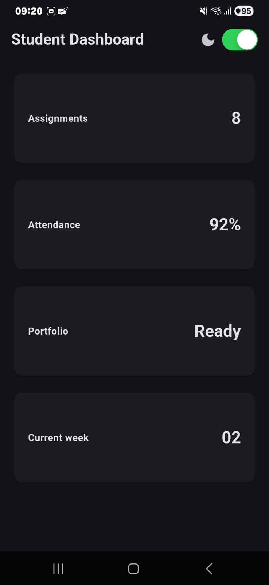 | 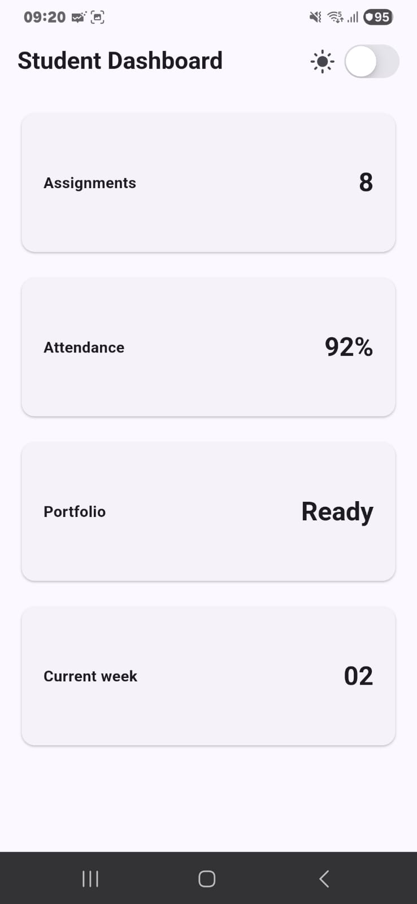 |
| *Switch hijau aktif (ON) dengan ikon bulan (Icons.dark_mode).* | *Switch abu-abu nonaktif (OFF) dengan ikon matahari (Icons.light_mode).* |

---

#### Pengujian Responsif Layar Lebar (2 Kolom)
Pengujian aplikasi pada orientasi landscape/lebar untuk memverifikasi logika pembagian kolom otomatis saat lebar melebihi batas breakpoint.

| Screenshot | Keterangan |
| :---: | :--- |
| 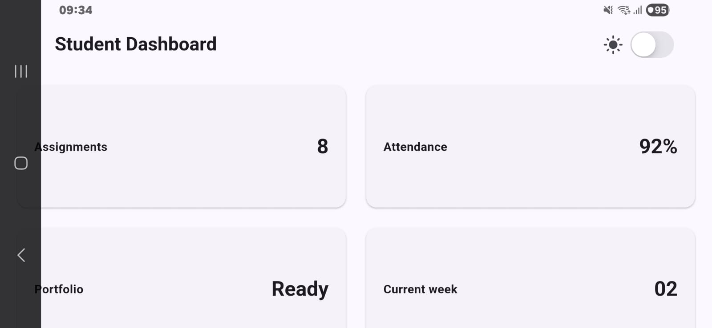 | **Student Dashboard (Layar Lebar / Landscape)** Grid beralih menjadi 2 kolom berdampingan (*Assignments* & *Attendance*, *Portfolio* & *Current week*). |

---

## Tugas Utama — Academic Overview

| Academic Overview — Layar Sempit (1 Kolom) | Academic Overview — Layar Lebar (2 Kolom) |
| :---: | :---: |
| 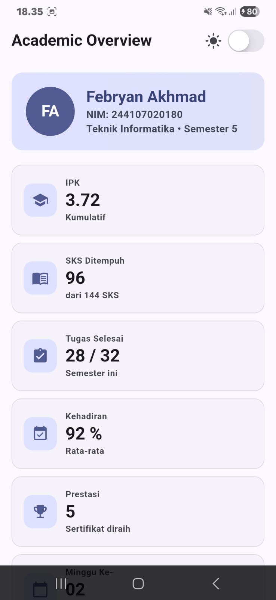 | 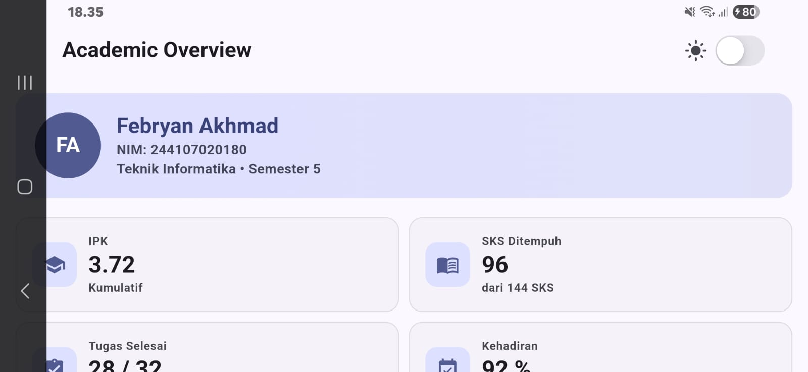 |
| *Mode portrait ponsel dengan 1 kolom penuh dan header profil gradien.* | *Mode landscape layar lebar dengan distribusi 2 kolom seimbang via `Expanded`.* |

---

## AI Prompt Challenge
 
- **Prompt 1:**
  > *"Bandingkan dua tata letak dashboard akademik untuk Flutter: versi GridView dan versi LayoutBuilder + Column. Jelaskan trade-off responsif dan aksesibilitasnya."*

| Screenshot AI Prompt 1 |
| :---: |
| 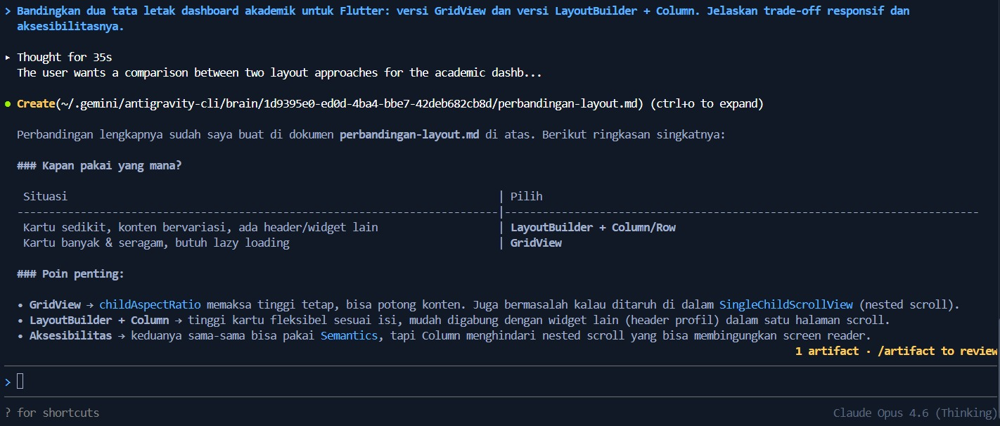 |

---

- **Prompt 2:**
  > *"Jelaskan kapan penggunaan Expanded justru menyebabkan overflow di dalam Row, beri contoh kode yang gagal dan perbaikannya."*

| Screenshot AI Prompt 2 |
| :---: |
| 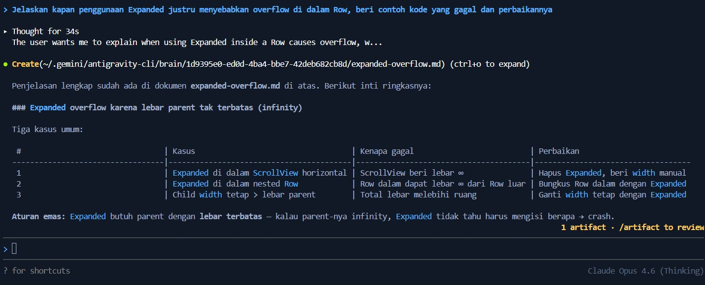 |

---

- **Prompt 3:**
  > *"Periksa kembali rekomendasi layout di atas: apakah tetap responsif di bawah 600px, apakah mengurangi aksesibilitas, dan apakah ada widget yang tidak tersedia di Flutter stabil saat ini?"*

| Screenshot AI Prompt 3 |
| :---: |
| 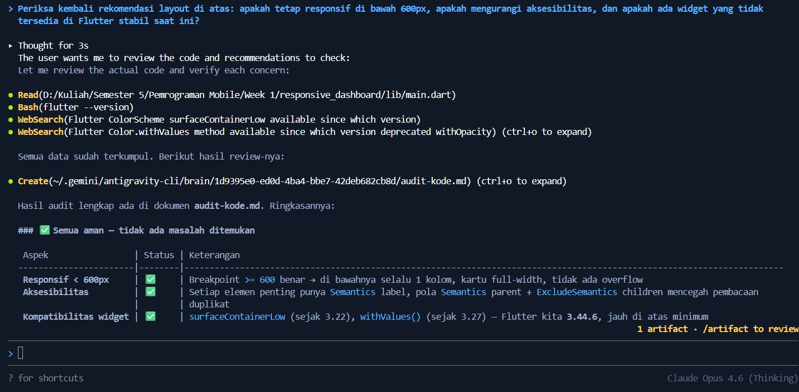 |

---
## Refactoring Challenge

**Verifikasi flutter analyze:**
    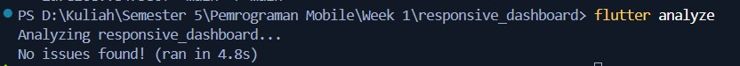 

---

## Testing Dasar (Widget Test)

| Struktur Direktori Testing |
| :---: |
| 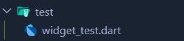 |

#### Hasil Eksekusi `flutter test`
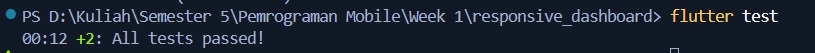

---

## Refleksi Pembelajaran

#### 1. Apa perbedaan cara berpikir imperative dan declarative saat membangun UI?
Pendekatan imperatif berfokus pada langkah manual untuk mengubah elemen UI satu per satu ketika data berubah, sedangkan pendekatan deklaratif memandang UI sebagai representasi langsung dari data saat ini di mana kerangka kerja secara otomatis merekonstruksi tampilan saat terjadi perubahan status.

#### 2. Kapan Expanded membantu dan kapan penggunaannya justru menghasilkan layout error?
Widget Expanded sangat membantu saat kita ingin membagi sisa ruang kosong secara fleksibel dan proporsional di dalam Row atau Column yang memiliki batas dimensi jelas. Sebaliknya, penggunaannya justru menimbulkan error tata letak jika diletakkan di dalam container yang sumbu ukurannya tidak terbatas.

#### 3. Bagaimana breakpoint dan theme memengaruhi pengalaman pengguna (UX)?
Penerapan breakpoint memastikan tata letak informasi tetap proporsional dan mudah dibaca baik di layar sempit maupun lebar, sedangkan dukungan tema terang dan gelap meningkatkan kenyamanan visual pengguna dalam berbagai kondisi pencahayaan dengan tetap menjaga kontras teks serta aksesibilitas.

#### 4. Apa yang Anda verifikasi dari rekomendasi AI setelah tugas inti selesai?
Hal yang diverifikasi adalah tata letak agar tidak mengalami overflow pada lebar layar di bawah 600px, memastikan seluruh widget yang digunakan resmi tersedia di versi Flutter stabil, serta membuktikan bahwa kodenya benar-benar bersih tanpa peringatan pada flutter analyze dan lulus seluruh pengujian otomatis pada flutter test.
