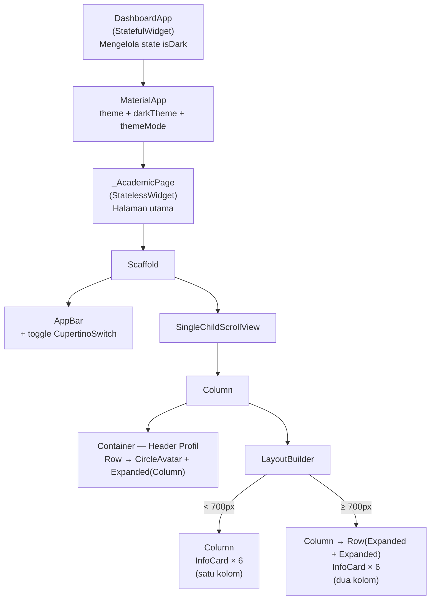
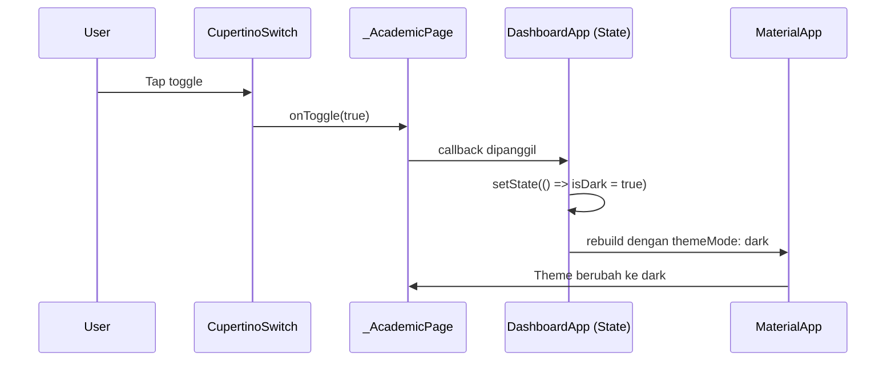
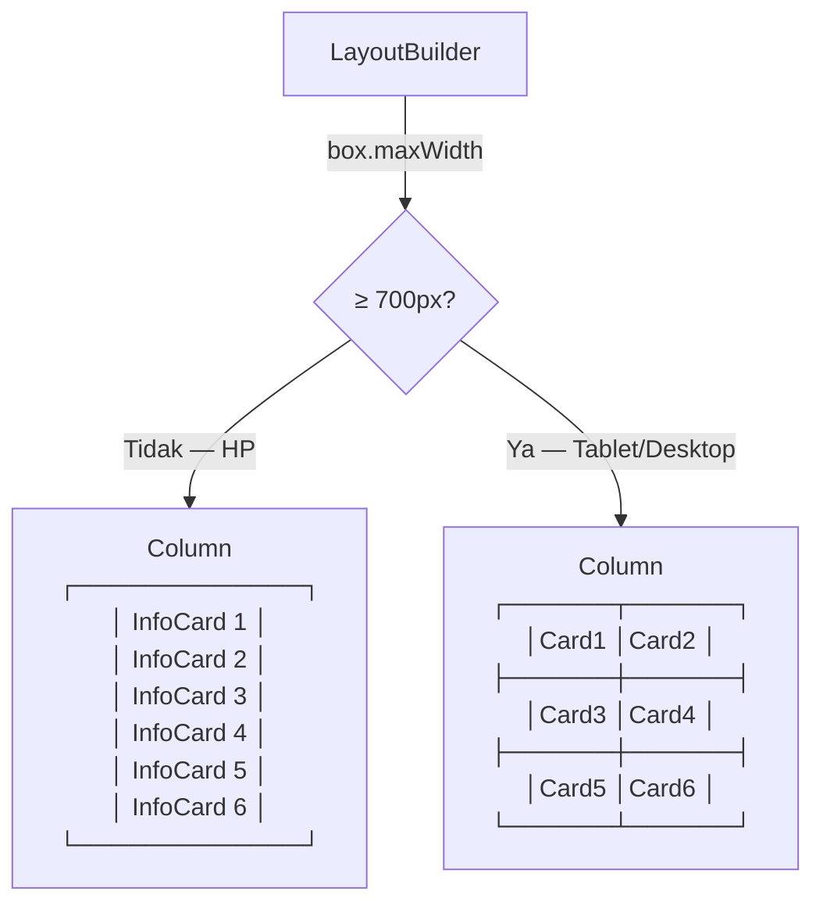

# Penjelasan Lengkap `main.dart`

Panduan ini menjelaskan **setiap bagian** kode agar kamu siap code review.

---

## Gambaran Besar — Widget Tree



---

## Bagian 1 — Import & Konstanta (Baris 1–7)

```dart
import 'package:flutter/cupertino.dart';   // untuk CupertinoSwitch
import 'package:flutter/material.dart';     // widget Material Design

const kWideBreakpoint = 700.0;             // breakpoint responsif

void main() => runApp(const DashboardApp());
```

| Kode | Penjelasan |
|---|---|
| `import cupertino.dart` | Mengimpor widget bergaya iOS. Kita hanya pakai `CupertinoSwitch` |
| `import material.dart` | Mengimpor semua widget Material Design (Scaffold, AppBar, Icon, dll) |
| `kWideBreakpoint` | Konstanta breakpoint. Didefinisikan **satu kali** di sini supaya kalau mau ubah, cukup ganti di satu tempat. Prefiks `k` = konvensi Flutter untuk konstanta top-level |
| `runApp()` | Titik masuk aplikasi Flutter, menjalankan widget root `DashboardApp` |

---

## Bagian 2 — `DashboardApp` (Baris 12–38)

```dart
class DashboardApp extends StatefulWidget { ... }

class _DashboardAppState extends State<DashboardApp> {
  bool isDark = false;                     // state tema

  Widget build(BuildContext context) {
    return MaterialApp(
      theme: ThemeData(useMaterial3: true, colorSchemeSeed: Colors.indigo),
      darkTheme: ThemeData(
        useMaterial3: true,
        brightness: Brightness.dark,
        colorSchemeSeed: Colors.indigo,
      ),
      themeMode: isDark ? ThemeMode.dark : ThemeMode.light,
      home: _AcademicPage(
        isDark: isDark,
        onToggle: (v) => setState(() => isDark = v),
      ),
    );
  }
}
```

### Kenapa `StatefulWidget`?
Karena harus menyimpan **state** `isDark` yang bisa berubah saat user menekan toggle.

### Alur data tema:



### Penjelasan properti MaterialApp:

| Properti | Nilai | Fungsi |
|---|---|---|
| `debugShowCheckedModeBanner` | `false` | Menghilangkan banner "DEBUG" di pojok kanan atas |
| `theme` | `ThemeData(...)` | Tema **terang** — warna digenerate otomatis dari `colorSchemeSeed: Colors.indigo` |
| `darkTheme` | `ThemeData(brightness: Brightness.dark, ...)` | Tema **gelap** — warna indigo disesuaikan untuk latar gelap |
| `themeMode` | `isDark ? dark : light` | Menentukan tema mana yang aktif |
| `useMaterial3` | `true` | Menggunakan Material Design 3 (tampilan lebih modern) |
| `colorSchemeSeed` | `Colors.indigo` | Flutter otomatis generate **seluruh palet warna** (primary, secondary, surface, dll) dari satu warna ini |

> [!IMPORTANT]
> **`colorSchemeSeed`** vs **`colorScheme`**: Dengan `colorSchemeSeed`, kita cukup beri 1 warna dan Flutter generate sisanya. Ini lebih mudah dan hasilnya konsisten untuk light & dark.

---

## Bagian 3 — `_AcademicPage` (Baris 43–178)

### 3a. Properti & Data Kartu (Baris 43–55)

```dart
class _AcademicPage extends StatelessWidget {
  const _AcademicPage({required this.isDark, required this.onToggle});
  final bool isDark;
  final ValueChanged<bool> onToggle;

  static const _cards = [
    (icon: Icons.school, title: 'IPK', value: '3.72', subtitle: 'Kumulatif'),
    // ... 5 kartu lainnya
  ];
```

| Kode | Penjelasan |
|---|---|
| `StatelessWidget` | Tidak punya state sendiri — state (`isDark`) diterima dari parent |
| `_AcademicPage` | Prefiks `_` = private, hanya bisa diakses di file ini |
| `final bool isDark` | Menerima state tema dari `DashboardApp` |
| `final ValueChanged<bool> onToggle` | Callback untuk mengirim perubahan toggle **kembali ke parent** |
| `static const _cards` | Data kartu dalam bentuk **Dart Record** — `(icon: ..., title: ..., ...)`. Type-safe dan lebih rapi dari List biasa |

> [!TIP]
> **Dart Record** `(icon: Icons.school, title: 'IPK', ...)` mirip seperti objek sederhana. Aksesnya pakai dot notation: `c.icon`, `c.title` — tanpa perlu buat class terpisah.

---

### 3b. AppBar + Toggle Tema (Baris 62–78)

```dart
appBar: AppBar(
  title: Semantics(header: true, child: const Text('Academic Overview')),
  actions: [
    Semantics(
      label: 'Pengaturan mode gelap',
      toggled: isDark,
      child: Row(children: [
        Icon(isDark ? Icons.dark_mode : Icons.light_mode,
            semanticLabel: isDark ? 'Mode gelap' : 'Mode terang'),
        const SizedBox(width: 4),
        CupertinoSwitch(value: isDark, onChanged: onToggle),
        const SizedBox(width: 12),
      ]),
    ),
  ],
),
```

**Breakdown:**

| Widget | Fungsi |
|---|---|
| `Semantics(header: true)` | Memberi tahu screen reader bahwa ini adalah **judul halaman** |
| `Semantics(label: ..., toggled: ...)` | Screen reader membaca: *"Pengaturan mode gelap, aktif/nonaktif"* |
| `Icon(isDark ? dark_mode : light_mode)` | Ikon berubah sesuai tema aktif |
| `semanticLabel` pada Icon | Deskripsi ikon untuk screen reader |
| `CupertinoSwitch` | Toggle bergaya iOS untuk mengganti tema |
| `onChanged: onToggle` | Saat di-tap → panggil callback → `setState` di parent → rebuild seluruh app |

---

### 3c. Header Profil (Baris 83–122)

```dart
Semantics(
  label: 'Profil: Febryan Akhmad, NIM 244107020180, ...',
  child: Container(
    decoration: BoxDecoration(
      gradient: LinearGradient(
        colors: [cs.primaryContainer, cs.secondaryContainer],
      ),
      borderRadius: BorderRadius.circular(16),
    ),
    padding: const EdgeInsets.all(20),
    child: ExcludeSemantics(
      child: Row(children: [
        CircleAvatar( ... ),            // Avatar inisial
        const SizedBox(width: 16),      // Spasi
        Expanded(                        // Teks mengisi sisa ruang
          child: Column(
            crossAxisAlignment: CrossAxisAlignment.start,
            children: [
              Text('Febryan Akhmad', ...),
              Text('NIM: 244107020180', ...),
              Text('Teknik Informatika • Semester 5', ...),
            ],
          ),
        ),
      ]),
    ),
  ),
),
```

**Widget yang dipakai dan kenapa:**

| Widget | Alasan |
|---|---|
| **`Container`** | Membungkus konten dengan `gradient`, `borderRadius`, dan `padding` |
| **`Row`** | Menyusun avatar dan teks secara **horizontal** (sejajar) |
| **`Expanded`** | Membuat `Column` teks **mengisi sisa lebar** setelah avatar. Tanpa ini, teks bisa overflow |
| **`Column`** | Menyusun 3 baris teks secara **vertikal** (ke bawah) |
| **`Semantics` + `ExcludeSemantics`** | Screen reader membaca **satu kalimat utuh** dari `Semantics.label`, bukan membaca setiap teks satu per satu |

**Kenapa `Semantics` + `ExcludeSemantics`?**
```
Tanpa:  Screen reader baca → "Febryan Akhmad" → "NIM 244107020180" → "Teknik Informatika..." (terpisah)
Dengan: Screen reader baca → "Profil: Febryan Akhmad, NIM 244107020180, Teknik Informatika, Semester 5" (satu kalimat utuh)
```

---

### 3d. Layout Responsif dengan LayoutBuilder (Baris 127–172)

```dart
LayoutBuilder(builder: (context, box) {
  final wide = box.maxWidth >= kWideBreakpoint;  // cek lebar layar

  if (!wide) {
    // SEMPIT: 1 kolom — setiap kartu ditumpuk vertikal
    return Column(
      children: [
        for (final c in _cards)
          Padding(
            padding: const EdgeInsets.only(bottom: 10),
            child: InfoCard(icon: c.icon, title: c.title, ...),
          ),
      ],
    );
  }

  // LEBAR: 2 kolom — pasangkan kartu dalam Row
  return Column(children: [
    for (int i = 0; i < _cards.length; i += 2)
      Row(children: [
        Expanded(child: InfoCard(...)),       // kartu kiri
        const SizedBox(width: 10),            // jarak antar kolom
        Expanded(child: InfoCard(...)),       // kartu kanan
      ]),
  ]);
});
```

**Cara kerja:**



| Kode | Penjelasan |
|---|---|
| `LayoutBuilder` | Memberi tahu lebar yang tersedia (`box.maxWidth`) — **widget ini kunci responsivitas** |
| `box.maxWidth >= kWideBreakpoint` | Kalau ≥ 700px → layar lebar |
| `for (final c in _cards)` | Loop semua kartu, tampilkan vertikal (1 kolom) |
| `for (int i = 0; i < _cards.length; i += 2)` | Loop dengan **step 2** → pasangkan kartu berdua per Row |
| `Expanded` di dalam `Row` | Setiap kartu mendapat **setengah lebar** Row — ukurannya sama rata |
| `i + 1 < _cards.length ? InfoCard(...) : SizedBox.shrink()` | Penanganan kalau jumlah kartu **ganjil** — slot terakhir dikosongkan |

---

## Bagian 4 — `InfoCard` (Baris 184–246)

```dart
class InfoCard extends StatelessWidget {
  const InfoCard({
    required this.icon,
    required this.title,
    required this.value,
    this.subtitle,         // opsional
    super.key,
  });

  final IconData icon;
  final String title;
  final String value;
  final String? subtitle;

  Widget build(BuildContext context) {
    final cs = Theme.of(context).colorScheme;   // warna dari tema
    final tt = Theme.of(context).textTheme;     // ukuran teks dari tema

    return Semantics(
      label: '$title: $value, $subtitle',
      readOnly: true,
      child: Container(
        decoration: BoxDecoration(
          color: cs.surfaceContainerLow,          // warna latar dari tema
          borderRadius: BorderRadius.circular(14),
          border: Border.all(color: cs.outlineVariant.withValues(alpha: 0.5)),
        ),
        child: ExcludeSemantics(
          child: Row(children: [
            Container(                            // kotak ikon
              width: 46, height: 46,
              decoration: BoxDecoration(
                color: cs.primaryContainer,        // warna dari tema
                borderRadius: BorderRadius.circular(12),
              ),
              child: Icon(icon, color: cs.primary),
            ),
            const SizedBox(width: 12),
            Expanded(                              // teks isi sisa ruang
              child: Column(
                crossAxisAlignment: CrossAxisAlignment.start,
                children: [
                  Text(title, ...),    // label kecil (bodySmall)
                  Text(value, ...),    // angka besar (headlineSmall, bold)
                  if (subtitle != null)
                    Text(subtitle!, ...),  // keterangan kecil
                ],
              ),
            ),
          ]),
        ),
      ),
    );
  }
}
```

### Kenapa ini **reusable**?
Karena menerima data lewat parameter — bisa dipanggil berkali-kali dengan data berbeda:
```dart
InfoCard(icon: Icons.school, title: 'IPK', value: '3.72', subtitle: 'Kumulatif')
InfoCard(icon: Icons.menu_book, title: 'SKS', value: '96', subtitle: 'dari 144')
// dst...
```

### Kenapa semua warna dari `Theme.of(context)`?
```dart
cs.surfaceContainerLow    // ← bukan Color(0xFFF5F5F5) yang di-hardcode
cs.primaryContainer       // ← bukan Colors.indigo[100]
tt.headlineSmall          // ← bukan TextStyle(fontSize: 24)
```
Supaya saat tema berganti (light ↔ dark), **semua warna otomatis menyesuaikan** tanpa kita tulis if-else manual.

### Struktur visual kartu:

```
┌──────────────────────────────────────────┐
│  ┌──────┐                                │
│  │ ICON │  title (kecil, abu-abu)        │
│  │      │  value (besar, tebal)          │
│  └──────┘  subtitle (kecil, abu-abu)     │
└──────────────────────────────────────────┘
     ↑              ↑
  Container      Expanded
  (fix 46x46)   (isi sisa)
```

---

## Pertanyaan yang Sering Ditanyakan Saat Code Review

### "Kenapa pakai `StatefulWidget` di `DashboardApp` tapi `StatelessWidget` di `_AcademicPage`?"
> `DashboardApp` menyimpan state (`isDark`) yang berubah → **StatefulWidget**. `_AcademicPage` hanya menerima data dari parent, tidak punya state sendiri → **StatelessWidget**. State diangkat ke atas (*lifted state up*) agar `MaterialApp` bisa rebuild saat tema berubah.

### "Kenapa `Expanded` dipakai di `Row`?"
> Agar child mengisi **sisa ruang horizontal**. Tanpa `Expanded`, `Column` teks di header profil dan di `InfoCard` tidak tahu harus selebar apa → bisa overflow. Di grid 2 kolom, `Expanded` membuat kedua kartu **berbagi lebar sama rata**.

### "Apa bedanya `Semantics` dan `ExcludeSemantics`?"
> `Semantics` = menambah label yang dibaca screen reader. `ExcludeSemantics` = menyembunyikan child dari screen reader. Dipakai bersamaan agar informasi dibaca sebagai **satu unit utuh**, bukan per-widget.

### "Kenapa breakpoint `700` bukan `600`?"
> `kWideBreakpoint = 700` dipilih agar dua kolom hanya muncul saat ruang benar-benar cukup. Angka ini bisa diubah di **satu tempat** (baris 5) tanpa harus cari di seluruh kode.

### "Bagaimana dark mode bisa terbaca tanpa tulis warna manual?"
> Semua warna diambil dari `Theme.of(context).colorScheme` — sistem warna Material 3 otomatis menyediakan warna kontras tinggi untuk light **dan** dark. Kita tidak pernah menulis warna hardcode seperti `Colors.white` atau `Color(0xFF...)`.
