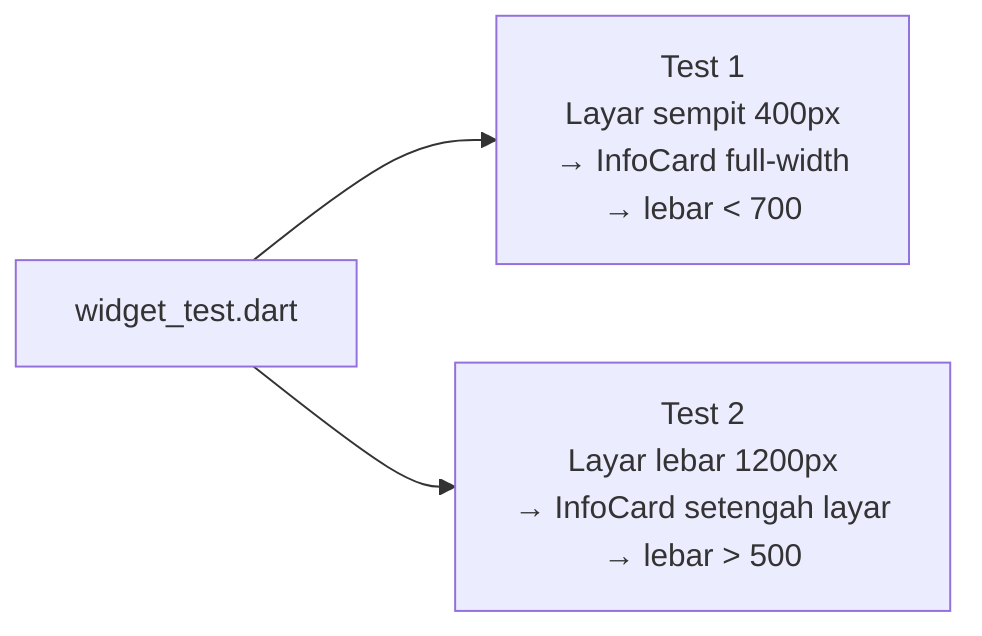
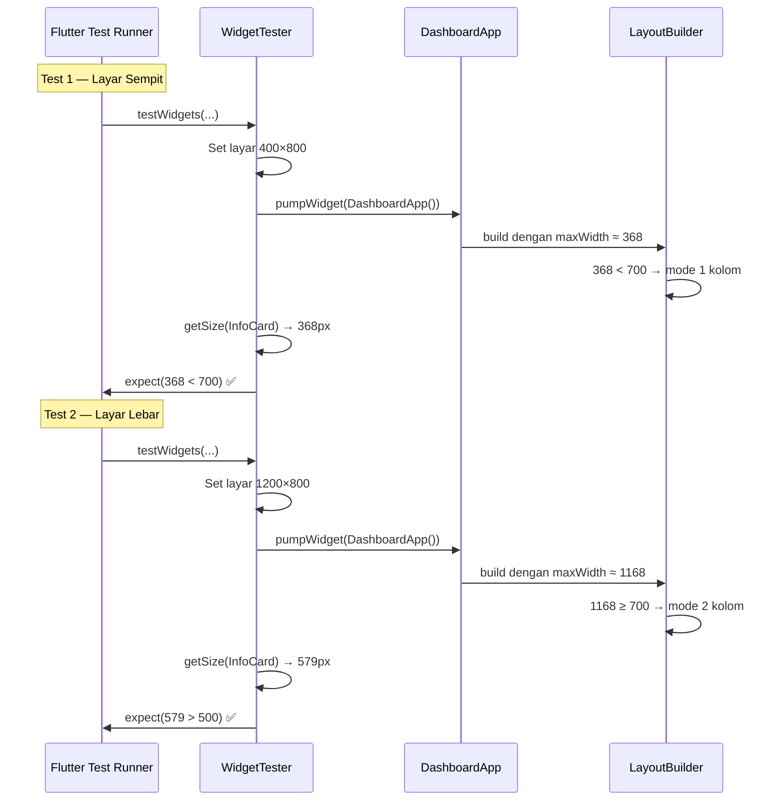

# Penjelasan Lengkap `widget_test.dart`

File ini berisi **widget test** untuk memverifikasi bahwa layout dashboard responsif — menampilkan 1 kolom di layar sempit dan 2 kolom di layar lebar.

---

## Gambaran Besar — Apa yang Diuji?



---

## Baris per Baris

### Import (Baris 1–3)

```dart
import 'package:flutter/material.dart';             // untuk Size, dll
import 'package:flutter_test/flutter_test.dart';     // framework testing Flutter
import 'package:responsive_dashboard/main.dart';     // import app kita (DashboardApp, InfoCard)
```

| Import | Fungsi |
|---|---|
| `material.dart` | Menyediakan class `Size` yang dipakai untuk set ukuran layar |
| `flutter_test.dart` | Menyediakan `testWidgets`, `tester`, `find`, `expect` — semua alat untuk testing |
| `main.dart` | Mengimpor widget dari app kita: `DashboardApp` (root) dan `InfoCard` (kartu yang mau diukur) |

---

### Fungsi `main()` (Baris 5)

```dart
void main() {
```

Sama seperti `main()` di app, tapi di sini isinya **test case**, bukan `runApp()`. Flutter test runner akan menjalankan semua `testWidgets()` di dalam fungsi ini.

---

### Test 1 — Layar Sempit (Baris 6–17)

```dart
testWidgets('Dashboard satu kolom di layar sempit', (tester) async {
    tester.view.physicalSize = const Size(400, 800);
    tester.view.devicePixelRatio = 1.0;
    addTearDown(tester.view.reset);

    await tester.pumpWidget(const DashboardApp());

    final width = tester.getSize(find.byType(InfoCard).first).width;
    expect(width, lessThan(700));
});
```

#### Penjelasan setiap baris:

| Baris | Kode | Penjelasan |
|---|---|---|
| 6 | `testWidgets('...', (tester) async { ... })` | Mendefinisikan satu test case. `tester` adalah objek yang bisa memanipulasi widget di lingkungan test |
| 7 | `tester.view.physicalSize = const Size(400, 800)` | **Mensimulasikan layar HP sempit** — lebar 400px, tinggi 800px |
| 8 | `tester.view.devicePixelRatio = 1.0` | Set rasio piksel = 1 supaya 1 logical pixel = 1 physical pixel (perhitungan tidak bingung) |
| 9 | `addTearDown(tester.view.reset)` | **Bersih-bersih** setelah test selesai — kembalikan ukuran layar ke default agar tidak mempengaruhi test lain |
| 11 | `await tester.pumpWidget(const DashboardApp())` | **Merender** seluruh aplikasi ke dalam lingkungan test (seperti `runApp` tapi di test) |
| 15 | `find.byType(InfoCard).first` | **Mencari** widget `InfoCard` pertama yang ditemukan di widget tree |
| 15 | `tester.getSize(...)` | **Mengukur** lebar dan tinggi widget tersebut di layar |
| 15 | `.width` | Ambil nilai **lebar**-nya saja |
| 16 | `expect(width, lessThan(700))` | **Assertion** — pastikan lebarnya kurang dari 700px |

#### Logika:

```
Layar = 400px
Padding SingleChildScrollView = 16 × 2 = 32px
Padding LayoutBuilder (dari Expanded) = 0
────────────────────────────
Lebar InfoCard ≈ 400 - 32 = 368px

368 < 700 ✅ TEST LULUS
```

> [!NOTE]
> Di layar sempit (< 700px = `kWideBreakpoint`), `LayoutBuilder` memilih **1 kolom** → setiap `InfoCard` mengisi penuh lebar layar. Makanya lebarnya pasti jauh di bawah 700px.

---

### Test 2 — Layar Lebar (Baris 19–30)

```dart
testWidgets('Dashboard dua kolom di layar lebar', (tester) async {
    tester.view.physicalSize = const Size(1200, 800);
    tester.view.devicePixelRatio = 1.0;
    addTearDown(tester.view.reset);

    await tester.pumpWidget(const DashboardApp());

    final width = tester.getSize(find.byType(InfoCard).first).width;
    expect(width, greaterThan(500));
});
```

#### Penjelasan setiap baris:

| Baris | Kode | Penjelasan |
|---|---|---|
| 20 | `Size(1200, 800)` | **Mensimulasikan layar lebar** — seperti tablet landscape atau desktop |
| 28 | `find.byType(InfoCard).first` | Cari `InfoCard` pertama |
| 28 | `tester.getSize(...).width` | Ukur lebarnya |
| 29 | `expect(width, greaterThan(500))` | **Assertion** — pastikan lebarnya lebih dari 500px |

#### Logika:

```
Layar = 1200px
Padding SingleChildScrollView = 16 × 2 = 32px
Lebar tersedia = 1200 - 32 = 1168px

LayoutBuilder → lebar ≥ 700 → mode 2 kolom
Row: [Expanded(InfoCard)] + SizedBox(10) + [Expanded(InfoCard)]

Lebar per InfoCard ≈ (1168 - 10) / 2 = 579px

579 > 500 ✅ TEST LULUS
```

> [!NOTE]
> Di layar lebar (≥ 700px), `LayoutBuilder` memilih **2 kolom** → setiap `InfoCard` mengisi setengah lebar layar. Setengah dari 1200px ≈ 579px, yang pasti lebih dari 500px.

---

## Alur Eksekusi Test



---

## Istilah Penting

| Istilah | Arti |
|---|---|
| `testWidgets` | Fungsi untuk membuat test case yang melibatkan widget Flutter |
| `WidgetTester` (tester) | Objek yang bisa merender widget, mensimulasikan interaksi, dan mengukur widget di lingkungan test |
| `tester.view.physicalSize` | Mengatur ukuran layar virtual untuk test (bukan layar asli) |
| `devicePixelRatio` | Rasio piksel fisik terhadap piksel logis. Set `1.0` agar `physicalSize` = ukuran logis yang diterima `LayoutBuilder` |
| `pumpWidget` | Merender widget ke dalam lingkungan test — seperti `runApp()` tapi di test |
| `find.byType(InfoCard)` | Finder yang mencari semua widget bertipe `InfoCard` di widget tree |
| `.first` | Ambil yang pertama ditemukan saja |
| `tester.getSize()` | Mengukur ukuran (lebar × tinggi) widget yang ditemukan |
| `expect(actual, matcher)` | **Assertion** — jika `actual` tidak sesuai `matcher`, test **GAGAL** |
| `lessThan(700)` | Matcher: nilai harus **kurang dari** 700 |
| `greaterThan(500)` | Matcher: nilai harus **lebih dari** 500 |
| `addTearDown` | Mendaftarkan fungsi yang dipanggil **setelah test selesai** untuk membersihkan perubahan |

---

## Pertanyaan Code Review

### "Kenapa `devicePixelRatio` di-set `1.0`?"
> Supaya `physicalSize` langsung sama dengan ukuran logis. Kalau ratio = 2.0, maka `Size(400, 800)` menghasilkan ukuran logis `200×400` — yang akan bikin `LayoutBuilder` dapat lebar 200 bukan 400, dan hasilnya bisa beda dari harapan.

### "Kenapa pakai `addTearDown(tester.view.reset)`?"
> Karena kita mengubah `physicalSize` dan `devicePixelRatio` milik `tester.view`. Kalau tidak di-reset, test berikutnya mungkin masih pakai ukuran layar dari test sebelumnya → hasil test tidak akurat.

### "Kenapa cek `lessThan(700)` dan `greaterThan(500)`, bukan angka pasti?"
> Karena lebar pasti `InfoCard` bergantung pada padding, spacing, dan rendering engine. Kita tidak perlu tahu angka persisnya — yang penting perilakunya: di layar sempit kartu **tidak selebar dua kolom** (< 700), dan di layar lebar kartu **cukup lebar** karena hanya berbagi 2 (> 500).

### "Kenapa `find.byType(InfoCard).first`, bukan `find.byType(InfoCard)` saja?"
> Karena ada 6 `InfoCard` di widget tree. `tester.getSize()` butuh **satu widget spesifik** untuk diukur. `.first` mengambil yang pertama ditemukan.

### "Apa bedanya `pumpWidget` dan `pump`?"
> `pumpWidget` = render widget **dari awal** (seperti `runApp`). `pump` = trigger rebuild/frame berikutnya (biasanya setelah `tap`, `setState`, atau animasi). Di test ini kita hanya perlu `pumpWidget` karena tidak ada interaksi.
