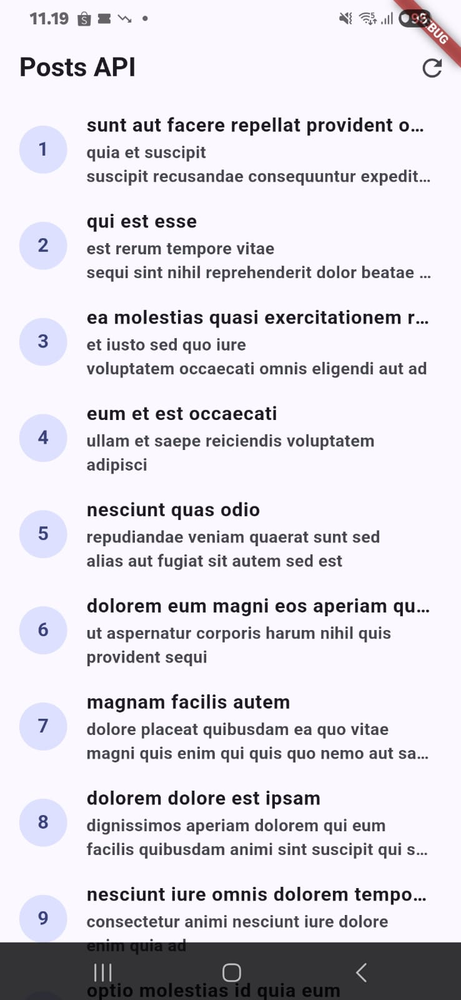
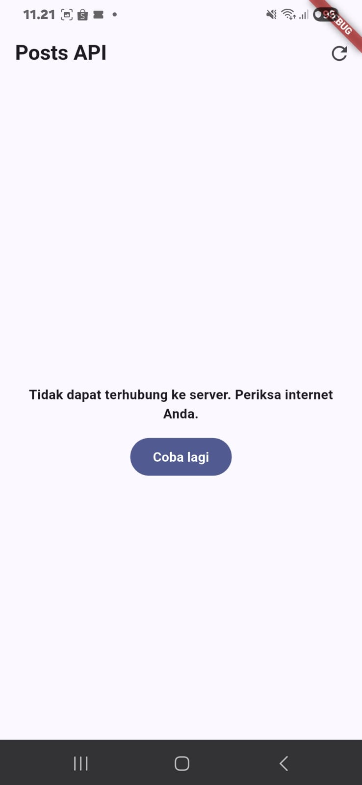
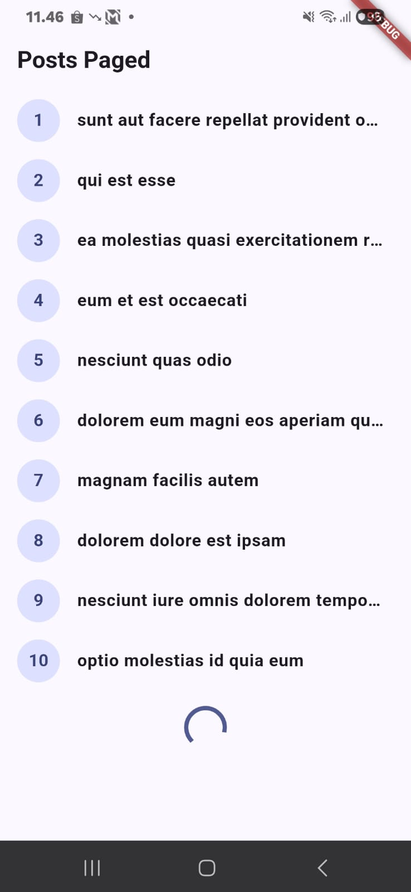
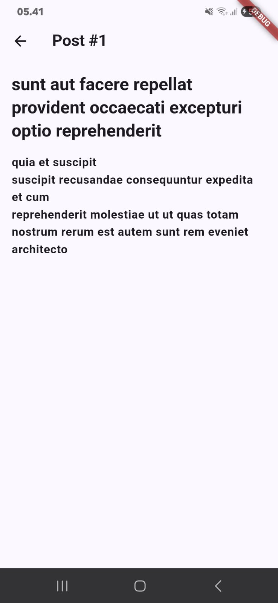
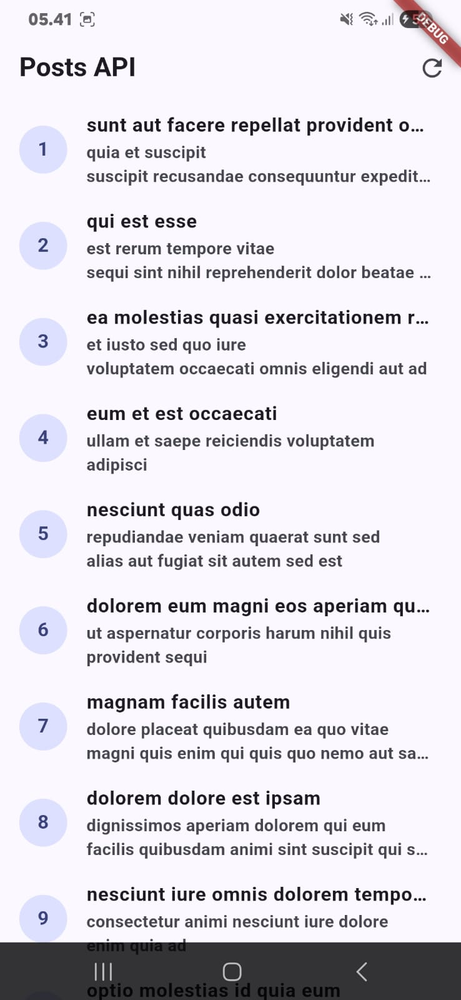
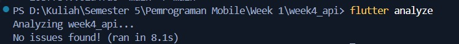

# Week 4 — Networking & REST API

### Praktikum 1 & 2 — Posts API (Success + Error State)

| Success State | Error State + Retry |
|:---:|:---:|
|  |  |

### Praktikum 2 — Error Handling (Airplane Mode)

| Error (airplane mode on) | Success (setelah retry) |
|:---:|:---:|
|  |  |

### Praktikum 3 — Pagination (Infinite Scroll)

| Paged Posts + Loading Indicator |
|:---:|
|  |

### Refactoring — Detail Page (GoRouter `/post/:id`)

| Detail Post | Post List (Refactored) |
|:---:|:---:|
|  |  |

### Testing — flutter analyze & flutter test

| flutter analyze | flutter test |
|:---:|:---:|
|  |  |

## Refleksi

### 1. Mengapa UI dilarang memanggil Dio langsung? Apa yang rusak jika aturan ini dilanggar?

Jika UI memanggil Dio langsung, maka:
- Kode jaringan tersebar, di banyak widget, sulit di-maintain dan diubah (misalnya ganti base URL harus edit semua widget).
- Tidak bisa di-tes  tanpa internet sungguhan, karena tidak bisa inject repository palsu.
- Error handling duplika, setiap widget harus menulis try-catch sendiri, rawan inkonsistensi.
- Pelanggaran separation of concern, widget seharusnya hanya mengurus tampilan, bukan logika jaringan.

Dengan repository pattern, perubahan API cukup dilakukan di satu tempat (repository), dan UI tinggal membaca AsyncValue dari provider.

### 2. Kapan pagination client-side cukup, dan kapan harus mengandalkan pagination server (_page/_limit)?

- Client-side cukup jika total data kecil (< 100 item) dan sudah dimuat semua ke memori. Filtering/sorting bisa dilakukan lokal tanpa request tambahan.
- Pagination server wajib jika data besar (ratusan/ribuan item). Tanpa pagination server, app harus download semua data sekaligus — boros bandwidth, lambat, dan bisa menyebabkan out-of-memory pada perangkat low-end. JSONPlaceholder menyediakan _page dan `_limit` untuk ini.

### 3. Bagaimana exception repository berubah menjadi AsyncError tanpa try/catch di setiap widget? Kapan try/catch eksplisit tetap dibutuhkan?

- Pada method build() di AsyncNotifier, exception yang dilempar oleh repository otomatis ditangkap oleh Riverpod dan diubah menjadi AsyncError. Sehingga UI tinggal pakai .when(error:) tanpa try-catch.
- Try/catch eksplisit tetap dibutuhkan, pada method imperatif seperti refresh() atau loadNextPage(), karena method ini dipanggil manual (bukan oleh framework Riverpod). Tanpa try-catch, exception akan menjadi unhandled dan crash.

### 4. Bagian mana dari hasil AI yang diperbaiki, dan mengapa?

| Perbaikan | Alasan |
|-----------|--------|
| Menambahkan retry: null pada provider | Tanpa ini, Riverpod 3 auto-retry dan test akan hang |
| Mengubah code == 500 jadi code >= 500 | Agar 502, 503, dll. juga tertangani |
| Menambahkan 4 edge case test | AI hanya buat happy path + 1 test, kurang coverage |
| Menambahkan Dart doc  | AI tidak beri komentar dokumentasi yang memadai |

Dokumentasi lengkap AI Challenge tersedia di [`docs/ai-challenge.md`](docs/ai-challenge.md).
