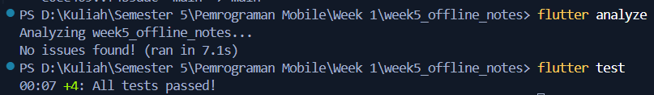

# #05 | Local Storage & Offline-First Notes

---

## 1. Dokumentasi Tiap Praktikum & Bukti Screenshot

### Praktikum 1: SharedPreferences (Preferensi Pengguna)
- **Implementasi:**
  - `lib/data/prefs.dart`: Mengelola key-value penyimpanan `dark_mode` dan `last_opened_at`.
  - `lib/pages/settings_page.dart`: Provider `darkModeProvider` dan `lastOpenedProvider` untuk antarmuka pengguna `/settings`.
  - `lib/main.dart`: Memanggil `markOpenedNow()` sebelum aplikasi dijalankan dan merender `ThemeMode` secara dinamis.
- **Bukti Screenshot:**

| Halaman Pengaturan (`/settings`) | Tema Gelap Aktif pada Halaman Utama |
| :---: | :---: |
|  |  |
| *Toggle Tema Gelap dan Timestamp Terakhir Dibuka* | *Tampilan antarmuka utama beralih ke Mode Gelap* |

---

### Praktikum 2: SQLite Repository & CRUD Catatan Persisten
- **Implementasi:**
  - `lib/data/local/db.dart`: Membuat tabel `notes` (`id`, `title`, `body`, `updated_at`, `dirty`) dan tabel `cached_posts`.
  - `lib/data/local/note.dart`: Model entitas catatan dengan konversi `toMap()` dan `fromMap()`.
  - `lib/data/repositories/note_repository.dart`: Menyediakan method `addNote()`, `fetchNotes()` (terurut `updated_at DESC`), `getNoteById()`, `updateNote()`, dan `deleteNote()`.
- **Bukti Screenshot:**

| Tampilan Awal (Empty State) | Dialog Tambah Catatan Baru |
| :---: | :---: |
|  |  |
| *Pesan "Belum ada catatan" saat database kosong* | *Input judul dan isi catatan baru* |

| Catatan Tersimpan di SQLite Lokal | Daftar Catatan Bertambah |
| :---: | :---: |
|  |  |
| *Catatan tersimpan lokal dengan status dirty* | *Daftar catatan terurut waktu terbaru* |

---

### Praktikum 3: Cache-First & Antrean Sinkronisasi (Offline-First)
- **Implementasi:**
  - `lib/data/sync.dart`:
    - `loadPostsCacheFirst()`: Menampilkan data cache lokal SQLite seketika tanpa menunggu jaringan, kemudian merefresh data di background.
    - `syncNotes()`: Memeriksa catatan kotor (`countDirty()`), menyimulasikan pengiriman ke server, dan menandai bersih (`markAllSynced()`).
  - **Aturan Resolusi Konflik (Conflict Resolution):** Menggunakan aturan **Last-Write-Wins (LWW)** berdasarkan `updated_at`. Record dengan timestamp paling baru yang dipertahankan saat sinkronisasi dua arah.
- **Bukti Screenshot:**

| Indikator Dirty Count = 1 | Indikator Dirty Count = 2 |
| :---: | :---: |
|  |  |
| *Badge merah '1' menandakan 1 antrean sync* | *Badge merah '2' saat ada 2 catatan belum sinkron* |

| Hasil Sinkronisasi Sukses (`syncNotes`) |
| :---: |
|  |
| *Tombol Sync ditekan: SnackBar "2 catatan disinkronkan", badge dirty menjadi 0 (ikon cloud done)* |

---

### Refactoring Challenge & Navigasi GoRouter
- **Implementasi:**
  - `lib/widgets/note_tile.dart`: Ekstraksi baris catatan dengan badge oranye bertuliskan `"belum tersinkron"` jika `dirty == true`.
  - `lib/pages/note_detail_page.dart`: Halaman detail catatan pada rute GoRouter `/note/:id` yang membaca data langsung dari SQLite lokal via `getNoteById(id)` (bukan dari state list) dan mendukung pengeditan catatan.
- **Bukti Screenshot:**

| Widget `NoteTile` dengan Badge Dirty | Detail Catatan 1 (`/note/:id`) | Detail Catatan 2 (`/note/:id`) |
| :---: | :---: | :---: |
|  |  |  |
| *Badge 'belum tersinkron' pada item* | *Detail catatan "materi mobile"* | *Detail catatan "tugas"* |

| Detail Catatan (Mode Gelap, Tersinkron) | Dialog Input Catatan (Mode Gelap) |
| :---: | :---: |
|  |  |
| *Status 'tersinkron' hijau & tombol edit* | *Dialog tambah catatan menyesuaikan dark theme* |

---

## 2. Hasil Analisis Statis & Pengujian Otomatis

- **Analisis Statis:** `flutter analyze`
- **Pengujian Unit & Provider:** `flutter test`

---

## 3. Ringkasan AI Challenge

Dokumentasi lengkap perbandingan storage tersedia di [`docs/ai_challenge.md`](docs/ai_challenge.md).

- **Tolak SharedPreferences untuk Koleksi:** SharedPreferences hanya untuk data primitif kecil. Menyimpan catatan sebagai JSON di SharedPreferences membuat query parsial, indexing, dan filter `dirty = 1` tidak mungkin dilakukan secara efisien.
- **Dukungan Antrean Sync:** Skema SQLite dirancang dengan kolom `dirty INTEGER NOT NULL DEFAULT 0` dan `updated_at TEXT NOT NULL` untuk resolusi konflik *Last-Write-Wins*.
- **Klaim Reaktivitas:** Dipahami bahwa `sqflite` tidak memiliki listener stream native seperti Drift, sehingga reaktivitas dicapai dengan pemanggilan `ref.invalidate()` pada Riverpod.
- **Keputusan Final:** Kombinasi **SharedPreferences** (untuk preferensi) + **sqflite** (untuk catatan) adalah pilihan paling tepat tanpa membebani proyek dengan code generation (`build_runner`) dari Drift.

---

## 4. Jawaban Refleksi Codelab

Dokumentasi lengkap refleksi tersedia di [`docs/refleksi.md`](docs/refleksi.md).

### 1. Mengapa daftar catatan tidak boleh disimpan di SharedPreferences? Apa yang rusak jika aturan ini dilanggar?
SharedPreferences hanya dirancang untuk data primitif kecil karena memuat seluruh file XML ke memori sekaligus. Menyimpan daftar catatan dalam bentuk JSON di dalamnya akan membebani CPU dan RAM akibat serialisasi ulang seluruh list pada setiap perubahan kecil, meniadakan fitur query dan indexing native, serta memicu risiko race condition dan korupsi data saat volume catatan membesar.

### 2. Kapan cache-first cukup, dan kapan Anda membutuhkan strategi lain (misalnya network-first untuk data harga real-time)?
Strategi cache-first ideal untuk data referensial atau konten pribadi seperti catatan dan artikel yang mengutamakan kecepatan render instan serta toleran terhadap sinkronisasi bertahap. Sebaliknya, network-first mutlak dibutuhkan untuk data kritis yang sangat sensitif terhadap waktu, seperti harga saham, saldo dompet digital, atau ketersediaan tiket, demi mencegah kerugian fatal akibat informasi usang.

### 3. Bagaimana dirty flag berubah menjadi antrean sync tanpa memblokir UI? Kapan antrean terpisah (tabel outbox) menjadi perlu?
Sistem tetap responsif karena UI langsung diperbarui seketika dari database lokal sesaat setelah status dirty = 1 disematkan, sementara proses sinkronisasi ke server berjalan di latar belakang secara asinkron tanpa memblokir antarmuka pengguna. Tabel outbox terpisah baru diperlukan jika aplikasi harus menjamin urutan mutasi data secara ketat atau membutuhkan pencatatan detail kegagalan seperti hitungan percobaan ulang (retry count) dan jeda backoff.

### 4. Bagian mana dari rekomendasi AI yang Anda tolak, dan mengapa?
Rekomendasi penggunaan Drift ditolak karena ketergantungannya pada build_runner menghasilkan boilerplate besar dan memperlambat proses kompilasi untuk proyek sederhana ini. Sebagai gantinya, kombinasi sqflite dan pembaruan status manual via Riverpod dipilih karena jauh lebih ringan, minim konfigurasi rumit, mudah diuji, dan sudah memenuhi kebutuhan offline-first.

