# Dokumentasi Screenshot Aplikasi Offline Notes

Dokumen ini memuat dokumentasi visual pengujian aplikasi **Offline Notes**, mencakup pengujian operasi CRUD offline, indikator antrean sinkronisasi (*dirty flag*), proses sinkronisasi, navigasi detail catatan (`GoRouter`), preferensi tema gelap/terang serta waktu terakhir dibuka (`SharedPreferences`), dan hasil pengujian otomatis (*unit & provider test*).

---

## 1. Pengujian Offline CRUD & Antrean Sinkronisasi

| Gambar | Deskripsi | Observasi |
| :---: | :--- | :--- |
| 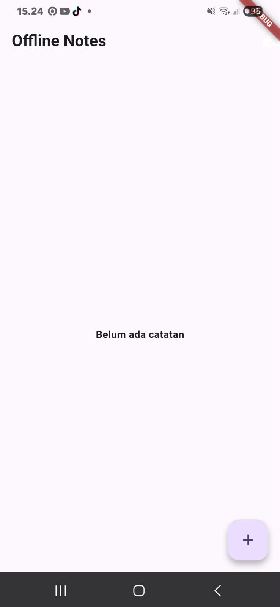 | **Tampilan Awal (Empty State)** | Saat aplikasi pertama kali dibuka dan database masih kosong, ditampilkan teks *"Belum ada catatan"* dan tombol FloatingActionButton `+`. |
| 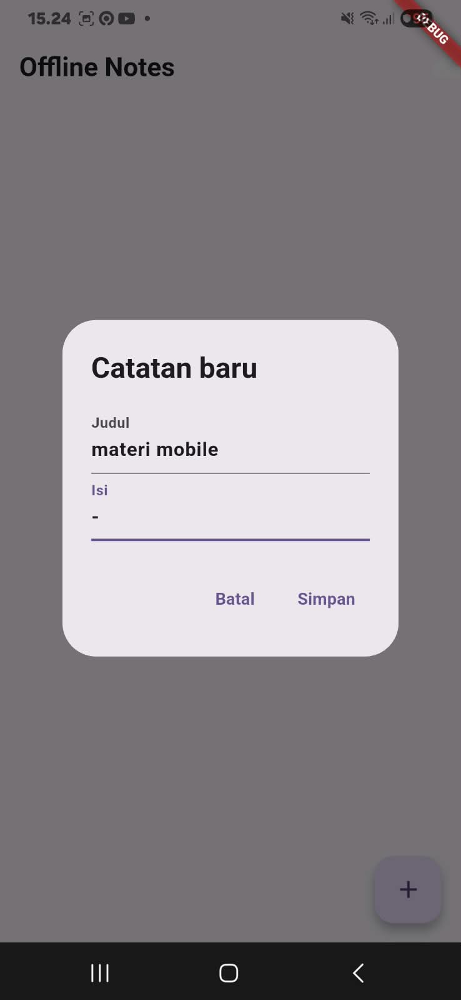 | **Dialog Tambah Catatan Baru** | Form dialog untuk menginputkan *Judul* ("materi mobile") dan *Isi* catatan baru. |
| 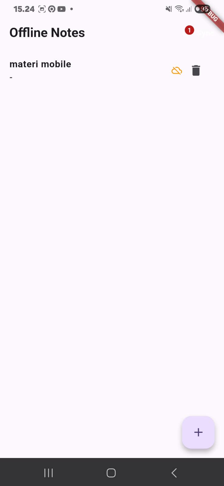 | **Catatan Tersimpan secara Lokal** | Catatan berhasil disimpan ke SQLite lokal dengan status `dirty = true`. Di AppBar muncul badge merah bertuliskan angka `1` dan tombol `Sync`. |
| 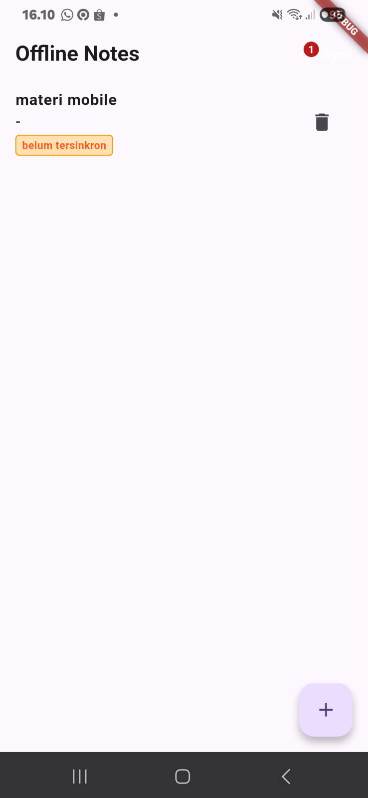 | **Widget `NoteTile` dengan Badge Dirty** | Widget `NoteTile` menampilkan label badge berwarna oranye `belum tersinkron` di bawah isi catatan untuk menandai data belum terunggah ke remote. |

---

## 2. Navigasi Detail Catatan (`GoRouter`)

| Gambar | Deskripsi | Observasi |
| :---: | :--- | :--- |
| 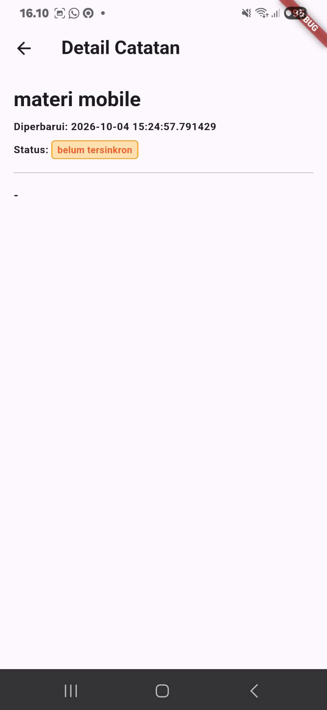 | **Detail Catatan 1 (`/note/:id`)** | Navigasi ke rute detail `/note/:id`. Data dibaca langsung dari SQLite melalui `NoteRepository` (bukan dari state list). Menampilkan judul, waktu diperbarui, status `belum tersinkron`, dan isi catatan. |
| 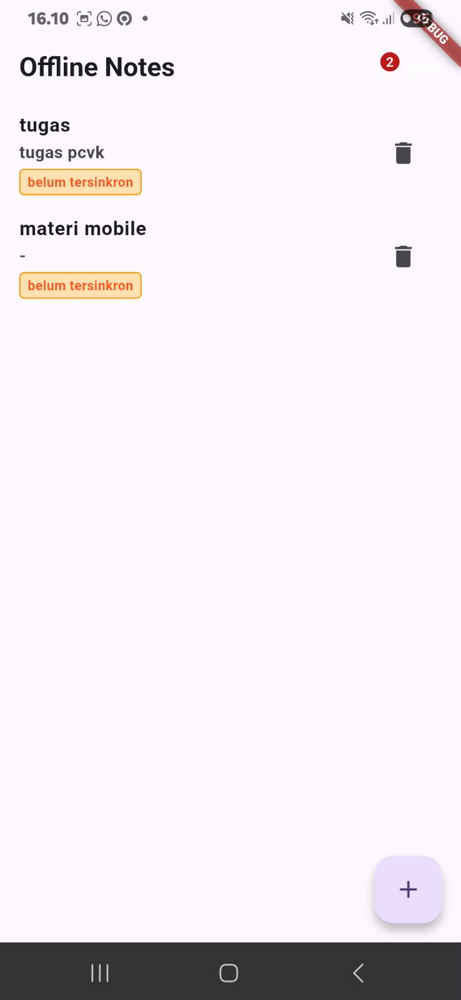 | **Daftar Catatan Bertambah (Dirty = 2)** | Ditambahkan catatan kedua ("tugas"). Daftar catatan diurutkan berdasarkan `updated_at DESC`. Badge dirty count pada AppBar bertambah menjadi `2`. |
| 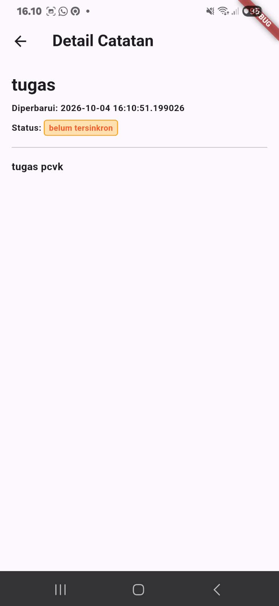 | **Detail Catatan 2 (`/note/:id`)** | Menampilkan detail catatan kedua ("tugas") dengan status `belum tersinkron`. |

---

## 3. Proses Sinkronisasi Data (*Sync Notes*)

| Gambar | Deskripsi | Observasi |
| :---: | :--- | :--- |
| 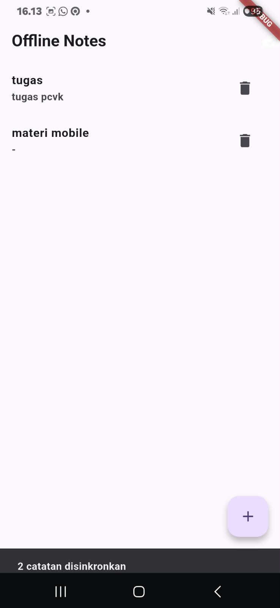 | **Hasil Sinkronisasi Berhasil** | Tombol `Sync` ditekan saat terkoneksi. Fungsi `syncNotes()` menjalankan simulasi upload, menandai semua catatan `dirty = 0` via `markAllSynced()`. Muncul SnackBar *"2 catatan disinkronkan"*, badge dirty count hilang, dan ikon AppBar berubah menjadi `cloud_done`. |

---

## 4. Pengaturan Preferensi (`SharedPreferences`) & Tema Gelap

| Gambar | Deskripsi | Observasi |
| :---: | :--- | :--- |
| 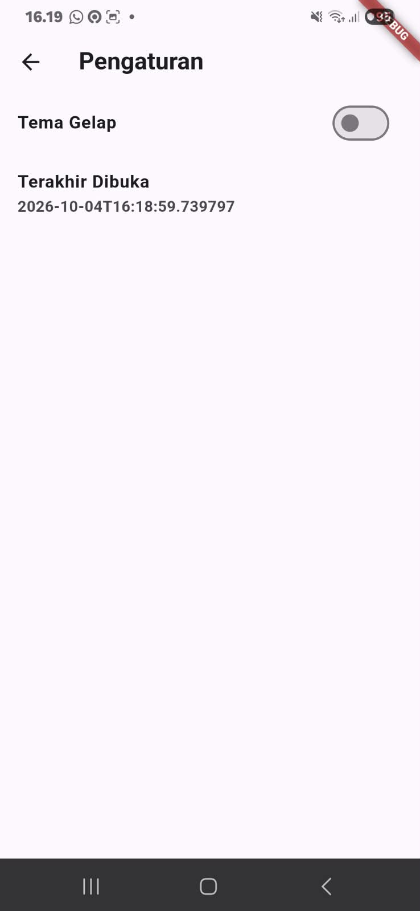 | **Halaman Pengaturan (`/settings`)** | Menampilkan switch toggle `Tema Gelap` dan timestamp `Terakhir Dibuka` yang tersimpan persisten melalui `SharedPreferences`. |
| 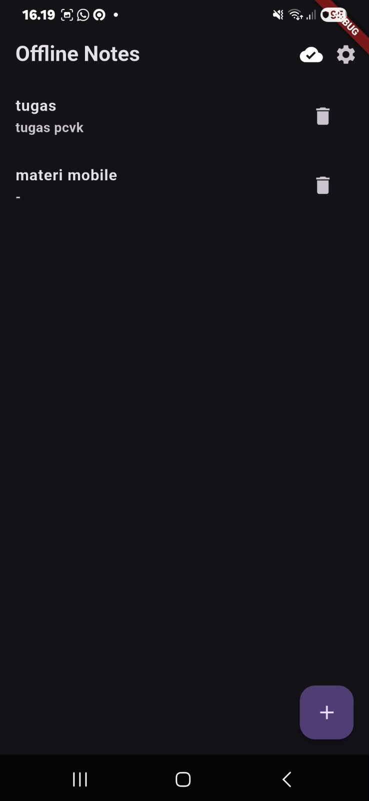 | **Mode Gelap pada Halaman Utama** | Setelah switch tema gelap diaktifkan, aplikasi beralih ke mode gelap (*Dark Theme*) secara reaktif melalui Riverpod `darkModeProvider`. |
| 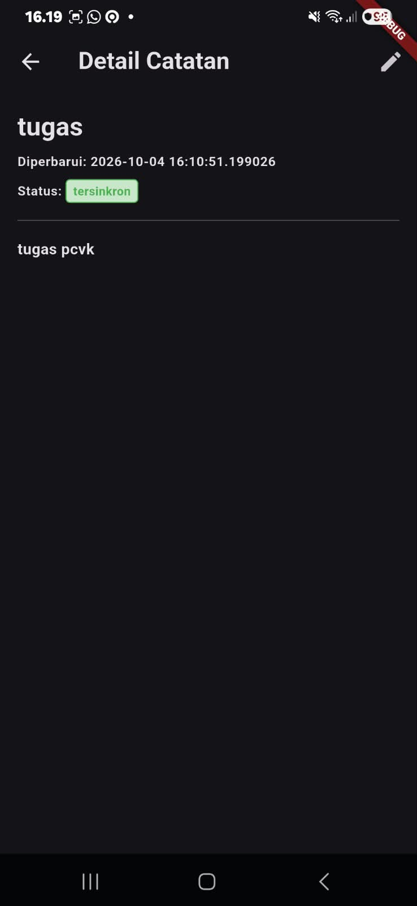 | **Detail Catatan dalam Mode Gelap** | Tampilan halaman detail pada mode gelap. Catatan menampilkan status `tersinkron` (warna hijau) serta tombol aksi Edit di AppBar. |
| 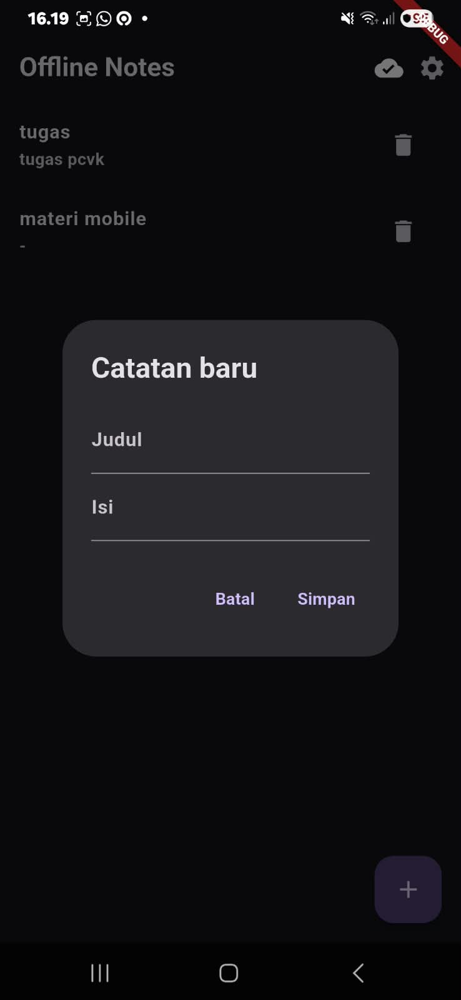 | **Dialog Input Catatan pada Mode Gelap** | Dialog tambah catatan baru menyesuaikan tema gelap sistem. |

---

## 5. Hasil Analisis Statis & Pengujian Otomatis

| Gambar | Deskripsi | Observasi |
| :---: | :--- | :--- |
|  | **Terminal `flutter analyze` & `flutter test`** | Eksekusi `flutter analyze` menunjukkan **No issues found!** dan `flutter test` menunjukkan **00:07 +4: All tests passed!** (seluruh pengujian model dan provider repository palsu berhasil tanpa error). |
